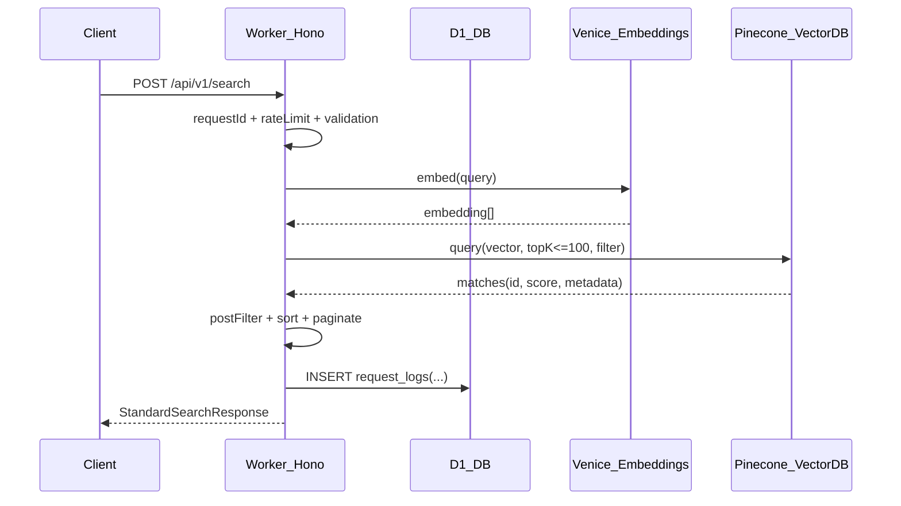

# How It Works — Agent0 Semantic Search Service

This document explains how `search-service/` works: the software architecture, main request and background flows, data structures, and the key components/pipelines.

---

## What this service does

`search-service/` provides **semantic search over ERC-8004 agent registrations**.

- **Online plane (query path)**: HTTP API receives a natural language query, generates an embedding (Venice AI), queries a vector index (Pinecone), applies filters/pagination/sorting, returns results, and logs requests (D1).
- **Offline plane (indexing path)**: a cron trigger schedules indexing, pushing chain sync jobs into a Queue; the queue consumer fetches updated agents from The Graph subgraph, computes embeddings, upserts/deletes vectors in Pinecone, and persists sync state/logs/locks into D1.

There is also a **dashboard** (`agent-search-dashboard/`) which consumes the Worker API and reads the same D1 DB for admin observability (search logs, sync logs, whitelist).

---

## High-level architecture

### Runtime components (Cloudflare)

- **Cloudflare Worker** (Hono) — `worker/src/index.ts`
  - `fetch`: HTTP API endpoints (search, health, capabilities, schemas)
  - `scheduled`: cron entrypoint (enqueues indexing jobs)
  - `queue`: Queue consumer (performs indexing work)
- **D1 Database** binding `DB` — state/config/logging/rate limiting
- **Cloudflare Queue** binding `INDEXING_QUEUE` — indexing job transport

### External dependencies

- **Venice AI**: embedding generation (`text-embedding-bge-m3`, 1024 dims)
- **Pinecone**: vector database (upsert/query/delete)
- **The Graph subgraph**: sources agent + registration file data for indexing

---

## Entry points and routing (the “three-headed” Worker)

The Worker exports a single `ExportedHandler` with three entry points:

- `fetch()` → HTTP routing via Hono
- `scheduled()` → cron scheduling (enqueue jobs)
- `queue()` → queue consumer (process jobs)

### Routes

Defined in `worker/src/index.ts`:

- **Legacy**
  - `GET /health`
  - `POST /api/search`
- **Standard v1**
  - `GET /api/v1/capabilities`
  - `GET /api/v1/health`
  - `POST /api/v1/search`
  - `GET /api/v1/schemas/:endpoint`

### Cross-cutting middleware

- **Security headers**: `X-Content-Type-Options`, `X-Frame-Options`, `X-XSS-Protection`
- **CORS**: allows `GET, POST, OPTIONS` from `*`
- **Error handler**: standard error response object

### Standard v1 middleware stack

For all `/api/v1/*` routes:

- `requestIdMiddleware` sets/echoes `X-Request-ID`

For `/api/v1/search` specifically:

- `rateLimitMiddleware` (D1-backed, default 6/min per IP)
- `validateSearchRequestV1` (schema-ish validation + pagination bounds)

---

## Key data structures

### Queue messages

The queue job payload is `ChainSyncMessage`:

- `type: 'chain-sync'`
- `chainId: string` (string in queue payload; cast to number in consumer)
- `batchSize?: number` (default 50)
- `subgraphUrl?: string` (optional override per chain)
- `logId?: number` (optional sync log row to aggregate into)

### Vector identity (Pinecone record IDs)

Vector IDs are stable and parseable:

- `vectorId = "<chainId>-<agentId>"`

This is used consistently for indexing, search result rendering, and deletions.

### Agent record indexed into Pinecone

`SemanticAgentRecord` (`worker/src/utils/types.ts`) is the canonical record used for embeddings and metadata:

- `chainId: number`
- `agentId: string` (subgraph agent `id`, typically `"chainId:tokenId"`)
- `name: string`
- `description: string`
- `capabilities?: string[]`
- `tags?: string[]`
- `defaultInputModes?: string[]`
- `defaultOutputModes?: string[]`
- `metadata?: Record<string, unknown>` (the bulk of filterable/searchable fields)

Indexing enriches `metadata` with:

- Registration file fields: `active`, `x402support`, `supportedTrusts`, `mcpTools`, `a2aSkills`, `mcpEndpoint`, `a2aEndpoint`, etc.
- Agent-level fields: `owner`, `operators`, `createdAt`, `updatedAt`
- Derived booleans: `mcp` and `a2a` (computed from endpoint presence)

### Search API shapes

There are two shapes:

1) **Legacy**

- Request: `{ query, topK?, filters?, minScore? }`
- Response: `{ query, results, total, timestamp }`

2) **Standard v1**

`StandardSearchRequest` (`worker/src/utils/standard-types.ts`):

- `query: string`
- `limit?: number` (default 10)
- `offset?: number` (offset pagination)
- `cursor?: string` (cursor pagination; base64 JSON with offset)
- `filters?: { equals?, in?, notIn?, exists?, notExists? }`
- `minScore?: number`
- `includeMetadata?: boolean` (default true)
- Extensions:
  - `name?: string` (substring post-filter)
  - `chains?: number[] | 'all'` (multi-chain convenience)
  - `sort?: string[]` (e.g. `["updatedAt:desc","name:asc"]`)

`StandardSearchResponse` includes:

- `provider: { name, version }`
- `requestId`
- `timestamp`
- optional pagination metadata (`hasMore`, `nextCursor`, `limit`, `offset?`)

---

## Persistence model (D1 database)

Migrations are in `migrations/` and create these tables:

### `sync_state`

Tracks per-chain incremental sync progress and per-agent hashes:

- `chain_id TEXT PRIMARY KEY`
- `last_updated_at TEXT NOT NULL`
- `agent_hashes TEXT` (JSON map `agentId -> hash`)

Used by `D1SemanticSyncStateStore` to resume indexing across Worker invocations.

### `indexing_config`

Key/value config table:

- `key TEXT PRIMARY KEY`
- `value TEXT NOT NULL` (JSON string)

Keys:

- `chains`: list of chain IDs
- `cron_interval`: cron expression (stored, but Cloudflare cron is configured in `wrangler.toml`)

### `sync_logs`

Per-cron-run summary:

- `status`: `in_progress | success | error`
- totals: `agents_indexed`, `agents_deleted`, `batches_processed`
- `chains` JSON, `duration_ms`, `error_message`

### `sync_locks`

Per-chain lock to avoid concurrent indexing:

- `chain_id TEXT PRIMARY KEY`
- `worker_id TEXT`
- `expires_at TEXT`

### `sync_log_events`

Batch-level observability:

- `sync_log_id` (FK to `sync_logs`)
- `chain_id`, `event_type`
- `agent_ids_indexed`, `agent_ids_deleted`
- `last_updated_at`, `error_message`

### `request_logs`

Search request logging for dashboard/analytics:

- `ip_address`, `query`, `filters`, `duration_ms`, `status_code`

### `rate_limit_tracking`

Rate limit state (per IP, fixed window):

- `ip_address` (PK)
- `request_count`
- `window_start`
- `expires_at` (used for cleanup)

### `admin_whitelist`

Shared with `agent-search-dashboard/` admin SIWE authentication:

- `wallet_address` (unique, lowercase)
- `added_at`, `added_by`

---

## Main flows (end-to-end)

## Search flow (standard v1)

### Overview

`POST /api/v1/search` does:

1. Request ID creation/propagation
2. Rate limiting (D1)
3. Request validation (bounds + pagination constraints)
4. Query embedding (Venice)
5. Vector query (Pinecone)
6. Post-filtering + pagination + sorting in Worker
7. D1 logging (request_logs)

### Why pagination is “special”

Pinecone’s `topK` is capped at 100 (`MAX_TOP_K`), so deep offset pagination must be limited.

The Worker uses an over-fetch strategy to support post-filtering:

- multiplier **2x** when no post-filter and no `minScore`
- multiplier **3x** when post-filter and/or `minScore` are present

This is why the validator enforces a maximum offset that depends on `limit`.

### Filter translation

Standard v1 filters are converted:

- `equals`: direct equality on Pinecone metadata fields
- `in`: `{$in: [...]}` on Pinecone metadata fields
- `notIn`: `{$nin: [...]}` on Pinecone metadata fields
- `exists/notExists`: post-filter in Worker (Pinecone doesn’t natively support them)

Additionally:

- `chains` can expand to `filters.in.chainId` (or `filters.equals.chainId` for a single chain)
- `name` is a post-filter substring match against `metadata.name`

### Search flow diagram



---

## Indexing flow (cron → queue → subgraph → embeddings → Pinecone)

### Scheduled handler (cron)

`scheduled.ts` is intentionally lightweight:

- validates required bindings (`DB`, `INDEXING_QUEUE`)
- initializes default `indexing_config` in D1 if needed
- reads chain list from D1 (`getChains`)
- creates `sync_logs` row (`in_progress`)
- enqueues one `ChainSyncMessage` per chain with the `logId`

### Queue consumer

`queue.ts`:

- deduplicates messages by chain within the batch
- uses `sync_locks` to prevent concurrent per-chain syncs
- runs `SemanticSyncRunner` with:
  - `D1SemanticSyncStateStore` (persists state)
  - `VeniceEmbeddingProvider`
  - `PineconeVectorStore`
- logs batch events (`sync_log_events`)
- aggregates totals into `sync_logs` using atomic `UPDATE ... + ?`
- marks `sync_logs` as `success` once all expected chains have completed

### Incremental sync algorithm

`SemanticSyncRunner` performs incremental indexing:

- Pages the subgraph using `updatedAt_gt lastUpdatedAt` in ascending `updatedAt`
- Converts each subgraph agent to `SemanticAgentRecord`
- Computes a deterministic hash for each record; only re-indexes if the hash changes
- Deletes vectors for “orphaned” agents (no registration file)
- Persists state (`lastUpdatedAt` and agent hashes) after every batch

### Indexing flow diagram

```mermaid
sequenceDiagram
  participant Cron
  participant Scheduled as Worker_Scheduled
  participant Queue as CF_Queue
  participant Consumer as Worker_QueueConsumer
  participant D1 as D1_DB
  participant Subgraph as TheGraph_Subgraph
  participant Venice as Venice_Embeddings
  participant Pinecone as Pinecone_VectorDB

  Cron->>Scheduled: scheduled(cron)
  Scheduled->>D1: initializeDefaults + getChains + INSERT sync_logs(in_progress)
  Scheduled->>Queue: send ChainSyncMessage per chain

  Queue->>Consumer: deliver batch(messages)
  Consumer->>Consumer: dedupe per chain
  Consumer->>D1: tryAcquire sync_lock(chain)
  Consumer->>D1: load sync_state(chain)
  Consumer->>Subgraph: query agents(updatedAt_gt lastUpdatedAt, first=batchSize)
  Subgraph-->>Consumer: agents[]
  Consumer->>Consumer: hash compare => toIndex/toDelete
  Consumer->>Venice: embed(agentText) (batch when possible)
  Venice-->>Consumer: vectors[]
  Consumer->>Pinecone: upsert vectors + delete orphans
  Consumer->>D1: save sync_state(chain)
  Consumer->>D1: INSERT sync_log_events(batch-processed)
  Consumer->>D1: UPDATE sync_logs aggregates; mark success when all chains complete
  Consumer->>D1: release sync_lock(chain)
```

---

## Provider pipelines

### Venice embedding pipeline

`VeniceEmbeddingProvider`:

- builds embedding text from: name + description + tags + capabilities + IO modes + selected metadata
- excludes verbose/unhelpful metadata fields (endpoints, wallets, timestamps)
- truncates text to avoid Venice token limits
- supports batch embeddings; if batch fails with token-limit-like errors, falls back to per-agent embedding

### Pinecone vector store pipeline

`PineconeVectorStore`:

- `initialize()` checks connectivity via `describeIndexStats()`
- `upsertBatch()` chunks into configurable batch sizes
- `query()` includes metadata by default
- normalizes metadata values to Pinecone-compatible types:
  - string/number/boolean or arrays of those

---

## Scripts and operational utilities

Scripts in `scripts/` support setup and maintenance.

- `sync-local-direct.ts`: runs sync in Node.js (no Workers timeouts) using `agent0-ts` runner, then writes the final sync state into D1 via `wrangler d1 execute`.
- `init-sync.ts`: starts `wrangler dev --remote` and attempts to trigger a sync for initial population.
- `reindex-metadata.ts`: updates Pinecone metadata fields without recomputing embeddings, by pulling fresh agent fields from the subgraph.
- `test-local-queue.ts`: local harness to apply migrations, start `wrangler dev`, and attempt to trigger indexing.

### Important note about `/api/sync`

Some scripts reference `POST /api/sync`, but the current Worker routes in `worker/src/index.ts` do **not** expose an `/api/sync` endpoint. In the current architecture, **indexing is triggered by cron → queue** (and the queue consumer performs the work).

If you want a manual HTTP trigger, it would need to be added explicitly.

---

## Dashboard integration (agent-search-dashboard)

`agent-search-dashboard/` (Next.js 15 on Cloudflare Pages) uses:

- The Worker’s public endpoints for search/health/capabilities
- The shared D1 DB for admin pages:
  - `request_logs`, `sync_logs`, `sync_log_events`
  - `admin_whitelist` (SIWE-gated admin access)

---

## Design constraints and tradeoffs

- **Pinecone `topK <= 100`** drives pagination constraints and offset caps.
- **exists/notExists** require post-filtering, which forces over-fetch and approximate totals.
- **Incremental indexing** uses `updatedAt` and per-agent hashes to minimize recompute and cost.
- **Concurrency** is managed by:
  - queue-message dedupe per chain (within a batch)
  - D1 locks per chain with expiration
- **Errors returned to clients** are sanitized to avoid leaking internal details (API keys, stack traces).


